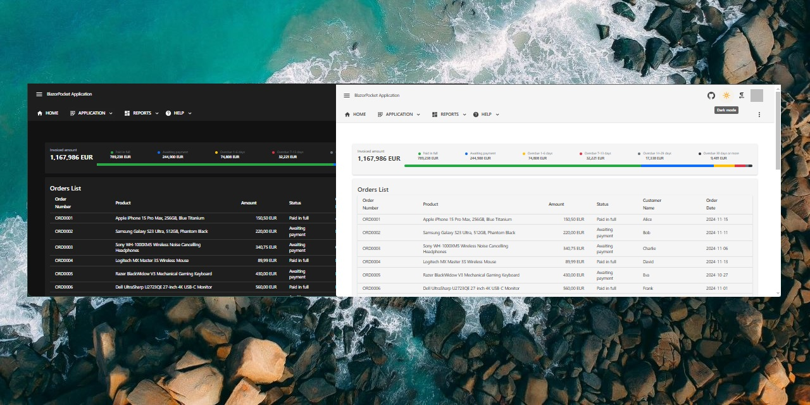

## CleanAspire - .NET 9 Minimal API + Blazor WebAssembly PWA Template with Aspire Support 
[](https://github.com/neozhu/cleanaspire/actions/workflows/dotnet.yml)
[](https://github.com/neozhu/cleanaspire/actions/workflows/github-code-scanning/codeql)
[](https://github.com/neozhu/cleanaspire/actions/workflows/docker.yml)



### 🚀 Overview  

**CleanAspire** is a cutting-edge, open-source template built on **.NET 9**, designed to accelerate the development of **lightweight**, **fast**, and **simple** Blazor WebAssembly or Progressive Web Applications (PWA). It seamlessly integrates **Minimal APIs**, **Aspire**, and **Scalar** for modern API documentation.  

With a focus on **Clean Architecture** and **extreme code simplicity**, CleanAspire provides developers with the tools to create responsive and maintainable web applications with minimal effort. The template also supports **Microsoft.Kiota** to simplify API client generation, ensuring consistency and productivity in every project.  

### 🌐 Offline Support  

CleanAspire fully supports **offline mode** through its integrated PWA capabilities, enabling your application to function seamlessly without an internet connection. By leveraging **Service Workers** and **browser caching**, the application can store essential resources and data locally, ensuring quick load times and uninterrupted access. Additionally, CleanAspire offers streamlined configuration options to help developers manage caching strategies and data synchronization effortlessly, guaranteeing that users receive the latest updates once the network is restored.

**Key Features of Offline Support:**

- **Service Workers Integration:** Efficiently handle caching and background synchronization to manage offline functionality.
- **Automatic Resource Caching:** Automatically caches essential assets and API responses, ensuring critical parts of the application are accessible offline.
- **Seamless Data Synchronization:** Maintains data consistency by synchronizing local changes with the server once the connection is reestablished.
- **User Experience Enhancements:** Provides fallback UI components and notifications to inform users about their offline status and any pending actions.

By incorporating robust offline capabilities, CleanAspire empowers developers to build resilient applications that deliver a consistent and reliable user experience, regardless of network conditions.


### 🔑 Key Features  

1. **Built-in Aspire Support**  
   - Fully integrated with **Aspire** for efficient application hosting and configuration.  
   - Simplifies the setup process while providing a robust foundation for lightweight applications.  

2. **Fast and Minimal .NET 9 Minimal APIs**  
   - Uses the latest .NET 9 features to create high-performance and efficient APIs.  
   - Includes **Scalar** for modern and concise OpenAPI documentation, replacing traditional Swagger tools.  

3. **Designed for Simplicity and Speed**  
   - Adopts extreme code simplicity for rapid development without sacrificing functionality.  
   - Ideal for developers looking to build quick, responsive Blazor WebAssembly applications or PWAs.  

4. **Blazor WebAssembly and PWA Integration**  
   - Combines the power of Blazor WebAssembly for interactive and lightweight client-side UIs.  
   - PWA capabilities ensure offline support and a seamless native-like experience, allowing users to access the application and data even when offline.  

5. **Streamlined API Client Integration**  
   - Utilizes **Microsoft.Kiota** to automatically generate strongly-typed API clients, reducing development overhead.  
   - Ensures consistent and error-free client-server communication.  

6. **Clean Architecture**  
   - Promotes modular, maintainable, and testable codebases through clear architectural layers.  

7. **Cloud-Ready with Docker**  
   - Preconfigured for Docker, enabling easy deployment to cloud platforms or local environments.  

8. **Real-Time Web Push Notifications**  
   - Integrated **Webpushr** to deliver instant browser notifications.  
   - Keeps users informed and engaged with real-time updates.  
   - Fully customizable notifications with targeted delivery and analytics support.  

9. **Integrated CI/CD Pipelines**  
   - Includes GitHub Actions workflows for automated building, testing, and deployment.  

10. **Offline Mode Support**  
    - **Offline mode enabled by default** to provide a seamless experience even without internet access.  
    - Uses **IndexedDB** to cache data locally, allowing the application to retrieve data and function offline.  
    - The system detects the online/offline status and fetches data from **IndexedDB** when offline, ensuring uninterrupted access to key features.  

 
### How to Create a New Object in a CRUD Application: A Step-by-Step Guide

https://github.com/neozhu/cleanaspire/issues/34

### 🌟 Why Choose CleanAspire?  

- **Lightweight and Fast:** Designed to create high-performance, minimal Blazor WebAssembly or PWA projects.  
- **Effortless Development:** Extreme simplicity in code makes it easy to start quickly and scale effectively.  
- **Advanced API Integration:** Automate client-side API generation with Microsoft.Kiota for faster results.  
- **Future-Ready Architecture:** Leverages the latest .NET 9 capabilities and Aspire hosting for modern web applications.
- 

### OpenAPI documentation
- https://apiservice.blazorserver.com/scalar/v1


### Here is an example of a docker-compose.yml file for a local Docker deployment:

```yml
version: '3.8'
services:
  apiservice:
    image: blazordevlab/cleanaspire-api:0.0.62
    environment:
      - ASPNETCORE_ENVIRONMENT=Development
      - AllowedHosts=*
      - ASPNETCORE_URLS=http://+:80;https://+:443
      - ASPNETCORE_HTTP_PORTS=80
      - ASPNETCORE_HTTPS_PORTS=443
      - DatabaseSettings__DBProvider=sqlite
      - DatabaseSettings__ConnectionString=Data Source=CleanAspireDb.db
      - AllowedCorsOrigins=https://cleanaspire.blazorserver.com,https://standalone.blazorserver.com,https://localhost:7114
      - Authentication__Google__ClientId=<your client id>
      - Authentication__Google__ClientSecret=<your client secret>
      - SendGrid__ApiKey=<your API key>
      - SendGrid__DefaultFromEmail=<your email>
      - Webpushr__Token=<your-webpushr-token>
      - Webpushr__ApiKey=<your-webpushr-api-keys>
      - Webpushr__PublicKey=<your-webpushr-public-key>
    ports:
      - "8019:80"
      - "8018:443"

  blazorweb:
    image: blazordevlab/cleanaspire-webapp:0.0.62
    environment:
      - ASPNETCORE_ENVIRONMENT=Production
      - AllowedHosts=*
      - ASPNETCORE_URLS=http://+:80;https://+:443
      - ASPNETCORE_HTTP_PORTS=80
      - ASPNETCORE_HTTPS_PORTS=443
    ports:
      - "8015:80"
      - "8014:443"

  standalone:
    image: blazordevlab/cleanaspire-standalone:0.0.62
    ports:
      - "8020:80"
      - "8021:443"


```

### Quick Start

1. **Clone the Repo**:
   ```bash
   git clone https://github.com/neozhu/cleanaspire.git
   ```

2. **Navigate to the Project Folder**:
   ```bash
   cd CleanAspire
   ```

3. **Run the Application**:
   ```bash
   dotnet run
   ```

4. **Access the Application**:
   Open your browser and go to `https://localhost:5001` to see the Blazor WebAssembly PWA in action.

### How to Register and Configure Webpushr

1. **Register on Webpushr**  
   - Visit the [Webpushr website](https://www.webpushr.com/) and sign up for an account.  
   - Complete the registration process to access your dashboard.  

2. **Obtain Required Keys**  
   - Navigate to the API configuration section in your Webpushr dashboard.  
   - Copy the following keys:  
     - **Token**  
     - **API Key**  
     - **Public Key**  

3. **Add Configuration to `appsettings.json`**  
   Add the keys obtained from Webpushr into your application configuration file as follows:  
   ```json
   "Webpushr": {
       "Token": "your-webpushr-token",
       "APIKey": "your-webpushr-api-key",
       "PublicKey": "your-webpushr-public-key"
   }
   ```

4. **Integrate Webpushr in the Application**  
   - Use the `PublicKey` for initializing Webpushr on the client-side to enable browser notifications.  
   - Use the `Token` and `API Key` securely on the server-side for API communication with Webpushr.


### Architecture

CleanAspire is structured following the **Clean Architecture** approach, dividing the solution into distinct layers:

```
CleanAspire/
│
├── Solution Items/
│   ├── .editorconfig
│
├── src/
│   ├── CleanAspire.Api/                # API Layer - .NET Minimal API
│   │   └── CleanAspire.Api.csproj
│   ├── CleanAspire.AppHost/            # Hosting Layer - Application hosting and configuration
│   │   └── CleanAspire.AppHost.csproj
│   ├── CleanAspire.Application/        # Application Layer - Business Logic
│   │   └── CleanAspire.Application.csproj
│   ├── CleanAspire.ClientApp/          # Client App Layer - Blazor WebAssembly or other client logic
│   │   └── CleanAspire.ClientApp.csproj
│   ├── CleanAspire.Domain/             # Domain Layer - Core Entities, including EF entities
│   │   └── CleanAspire.Domain.csproj
│   ├── CleanAspire.Infrastructure/     # Infrastructure Layer - Data Access, External Services
│   │   └── CleanAspire.Infrastructure.csproj
│   ├── CleanAspire.ServiceDefaults/    # Service Defaults - Predefined configurations for services
│   │   └── CleanAspire.ServiceDefaults.csproj
│
├── src/Migrators/
│   ├── Migrators.MSSQL/                # SQL Server Migration Scripts
│   │   └── Migrators.MSSQL.csproj
│   ├── Migrators.PostgreSQL/           # PostgreSQL Migration Scripts
│   │   └── Migrators.PostgreSQL.csproj
│   ├── Migrators.SQLite/               # SQLite Migration Scripts
│   │   └── Migrators.SQLite.csproj
│
├── tests/
│   ├── CleanAspire.Tests/              # Unit and Integration Tests
│   │   └── CleanAspire.Tests.csproj
│
├── README.md                           # Project README
├── LICENSE                             # License Information
└── CleanAspire.sln                     # Solution File

```

### Contributions

Contributions are welcome! If you want to add features, report bugs, or just suggest improvements, please feel free to submit issues or pull requests.

### License

This project is licensed under the [MIT License](LICENSE).

### Get Involved

- **Star the Repository**: If you like CleanAspire, please give it a star! 🌟
- **Follow the Project**: Stay updated with the latest developments by watching the repository.
- **Join Discussions**: Share your thoughts and ideas to make CleanAspire even better.

### Contact

Feel free to reach out if you have questions or feedback. Let's build something amazing together with **CleanAspire**!

